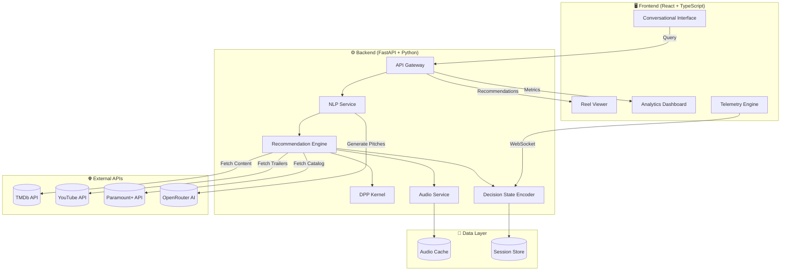
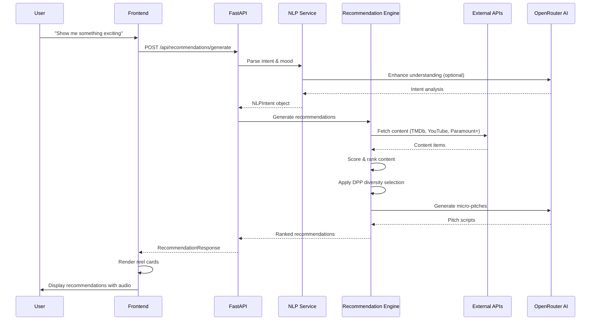
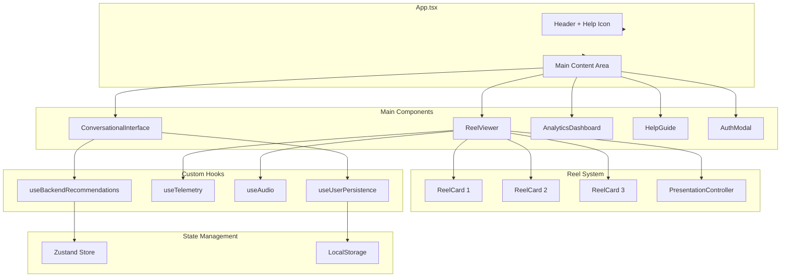
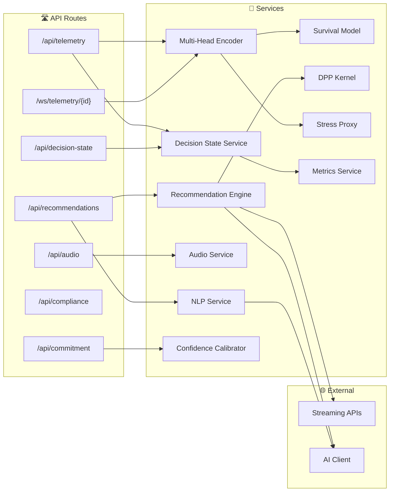
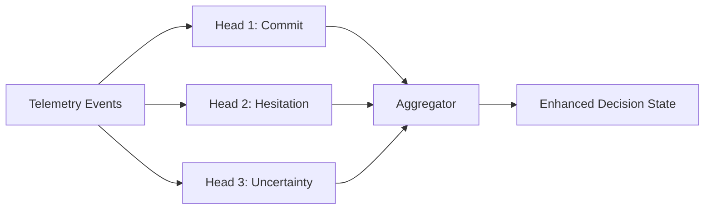
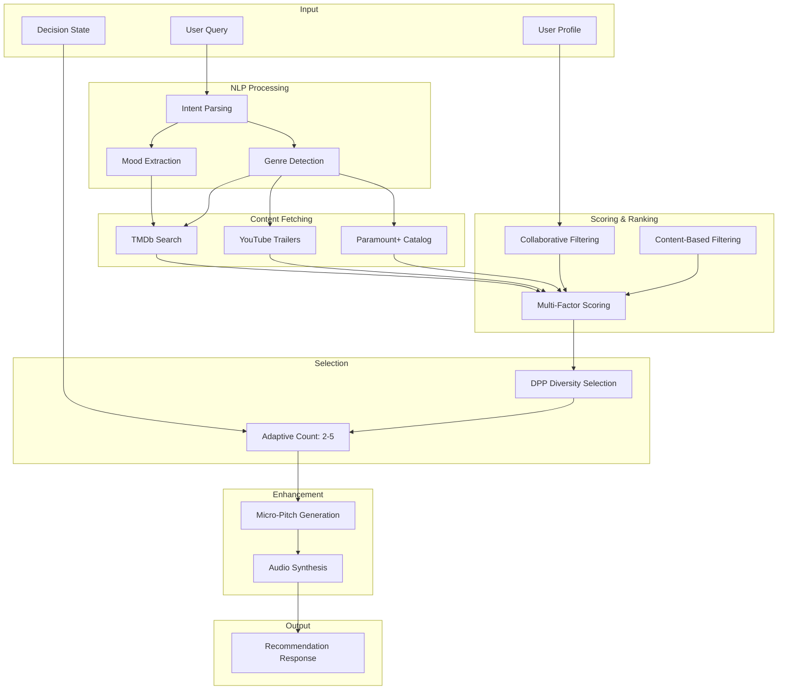
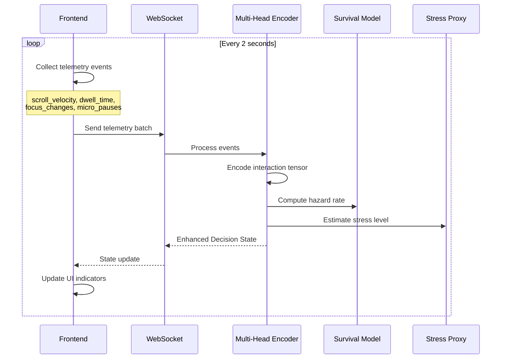

# 🎬 Sequential Narrative AI

**AI-Driven Sequential Narrative Recommendation System for Streaming Media**

A revolutionary approach to content discovery that replaces traditional grid-based browsing with an AI-powered conversational interface. Instead of scrolling through endless thumbnails, users simply ask "What should I watch?" and receive personalized, narrative-driven recommendations.


---

## 📑 Table of Contents

- [Features](#-features)
- [System Architecture](#-system-architecture)
- [Frontend Architecture](#-frontend-architecture)
- [Backend Architecture](#-backend-architecture)
- [Data Flow](#-data-flow)
- [API Reference](#-api-reference)
- [Quick Start](#-quick-start)
- [Configuration](#-configuration)
- [Project Structure](#-project-structure)
- [Key Algorithms](#-key-algorithms)
- [Development Guide](#-development-guide)

---

## ✨ Features

| Feature | Description |
|---------|-------------|
| 🧠 **Natural Language Processing** | Conversational interface with intent understanding, mood extraction |
| 🎯 **AI Recommendation Engine** | Multi-factor scoring with DPP diversity optimization |
| 🎥 **Reel-Style Presentation** | TikTok-inspired sequential cards with Ken Burns animations |
| 🔊 **Audio Narration** | Web Speech API with natural-sounding micro-pitches |
| 📊 **Decision State Encoding** | Real-time stress monitoring and behavioral analysis |
| 🔄 **Real-Time Telemetry** | WebSocket-based behavioral signal streaming |
| 📈 **Analytics Dashboard** | CCR, DLR, diversity index, and calibration metrics |
| 🔐 **Privacy Controls** | GDPR/CCPA compliance, child safety mode |

---

## 🏗 System Architecture

### High-Level Overview



### Component Interaction



---

## 🎨 Frontend Architecture

### Component Hierarchy



### Frontend Tech Stack

| Layer | Technology | Purpose |
|-------|------------|---------|
| UI Framework | React 18 | Component-based UI |
| Language | TypeScript 5.3 | Type safety |
| Build Tool | Vite | Fast HMR, bundling |
| Styling | Tailwind CSS | Utility-first CSS |
| Animation | Framer Motion | Smooth transitions |
| State | Zustand | Lightweight state management |
| HTTP | Fetch API | API communication |
| WebSocket | Native WS | Real-time telemetry |
| Audio | Web Speech API | Text-to-speech |

### Key Components

#### ConversationalInterface
```
┌─────────────────────────────────────────┐
│  🎬 What are you in the mood for?       │
├─────────────────────────────────────────┤
│  ┌─────────────────────────────────┐    │
│  │ Ask me anything...          🎤  │    │
│  └─────────────────────────────────┘    │
├─────────────────────────────────────────┤
│  [Exciting] [Relax] [Surprise] [Docs]   │
└─────────────────────────────────────────┘
```

#### ReelViewer
```
┌─────────────────────────────────────────┐
│ ← 1/3 →        [Analytics] [🔊] [✕]    │
├─────────────────────────────────────────┤
│                                         │
│     ┌───────────────────────────┐       │
│     │                           │       │
│     │     🎬 Movie Poster       │       │
│     │                           │       │
│     │   "Mission Impossible"    │       │
│     │   Action • 2h 30m • 8.5★  │       │
│     │                           │       │
│     │   [▶ Watch Now]           │       │
│     └───────────────────────────┘       │
│                                         │
│  ○ ● ○  (Progress indicators)           │
└─────────────────────────────────────────┘
```

---

## ⚙️ Backend Architecture

### Service Architecture



### Backend Tech Stack

| Layer | Technology | Purpose |
|-------|------------|---------|
| Framework | FastAPI | Async API framework |
| Language | Python 3.10+ | Backend logic |
| Validation | Pydantic | Data models |
| ASGI Server | Uvicorn | High-performance server |
| AI Integration | OpenRouter | LLM for NLP/pitches |
| TTS | gTTS / Web Speech | Audio generation |
| WebSocket | FastAPI WS | Real-time communication |

### Core Services

#### Recommendation Engine
```python
# Scoring Formula
score = (
    0.25 * genre_match +      # Genre alignment
    0.20 * mood_match +       # Mood compatibility  
    0.15 * rating_factor +    # Content quality
    0.15 * recency_factor +   # Freshness
    0.10 * popularity +       # Social proof
    0.10 * personalization +  # User history
    0.05 * diversity_bonus    # Variety boost
)
```

#### DPP Kernel (Diversity Optimization)
```python
# L-matrix construction
L[i,j] = q[i] * S[i,j] * q[j]
# where:
#   q[i] = quality score of item i
#   S[i,j] = similarity between items i and j

# Selection maximizes: log det(L_S) + λ * Σ ΔC(i)
```

#### Multi-Head Decision Encoder


---

## 🔄 Data Flow

### Recommendation Generation Flow



### Real-Time Telemetry Flow



---

## 📡 API Reference

### Recommendations API

#### Generate Recommendations
```http
POST /api/recommendations/generate
Content-Type: application/json

{
  "query": "something exciting",
  "user_profile": {
    "id": "user-123",
    "viewing_history": [...],
    "preferences": {
      "favorite_genres": ["Action", "Sci-Fi"],
      "preferred_moods": ["exciting", "thrilling"]
    },
    "decision_state": {
      "stress_level": 0.3,
      "scroll_velocity": 0,
      "dwell_time": 5000
    }
  }
}
```

**Response:**
```json
{
  "recommendations": [
    {
      "id": "rec-1",
      "content": {
        "id": "tmdb-123",
        "title": "Mission: Impossible",
        "type": "movie",
        "genre": ["Action", "Thriller"],
        "rating": 7.8,
        "poster_url": "https://...",
        "trailer_url": "https://youtube.com/..."
      },
      "score": 0.92,
      "micro_pitch": {
        "script": "Action-packed espionage at its finest...",
        "hook": "What if one man could save the world?",
        "call_to_action": "Start watching now"
      },
      "audio_url": "/audio/abc123.mp3"
    }
  ],
  "total_count": 3,
  "narrative_intro": "Ready for a thrill? Here are my top picks...",
  "decision_metrics": {
    "stress_level": 0.3,
    "optimal_count": 3,
    "hesitation_score": 0.2
  }
}
```

### Telemetry API

#### WebSocket Connection
```javascript
const ws = new WebSocket('ws://localhost:8888/ws/telemetry/user-123');

// Send telemetry batch
ws.send(JSON.stringify({
  user_id: "user-123",
  session_id: "session-456",
  events: [
    { event_type: "scroll", value: 150, timestamp: 1234567890 },
    { event_type: "dwell", value: 5000, content_id: "movie-1", timestamp: 1234567895 }
  ],
  window_start: 1234567890,
  window_end: 1234567900
}));

// Receive enhanced state
ws.onmessage = (event) => {
  const { enhanced_state } = JSON.parse(event.data);
  // { commit_probability: 0.7, hesitation_score: 0.2, ... }
};
```

### All Endpoints

| Endpoint | Method | Description |
|----------|--------|-------------|
| `/api/recommendations/generate` | POST | Generate recommendations |
| `/api/recommendations/content/{id}` | GET | Get content details |
| `/api/recommendations/content/{id}/pitch` | POST | Generate micro-pitch |
| `/api/telemetry/batch` | POST | Send telemetry batch (HTTP) |
| `/api/telemetry/state/{user_id}` | GET | Get decision state |
| `/ws/telemetry/{user_id}` | WS | Real-time telemetry |
| `/api/decision-state/{user_id}` | GET | Get decision state |
| `/api/audio/generate` | POST | Generate TTS audio |
| `/api/commitment/evaluate` | POST | Evaluate commit trigger |
| `/api/metrics/aggregate` | GET | Get aggregated metrics |
| `/api/compliance/privacy/{user_id}` | GET | Get privacy settings |
| `/health` | GET | Health check |
| `/docs` | GET | Swagger documentation |

---

## 🚀 Quick Start

### Option 1: Docker (Recommended)

```bash
# Clone repository
git clone https://github.com/your-org/sequential-narrative-ai.git
cd sequential-narrative-ai

# Create environment file
cp backend/.env.example backend/.env
# Edit backend/.env with your API keys

# Build and run
docker-compose up --build
```

Access at **http://localhost:3000**

### Option 2: Manual Setup

#### Prerequisites
- Node.js 18+
- Python 3.10+
- npm or yarn

#### 1. Install Dependencies

```bash
# Frontend
npm install

# Backend
cd backend
python3 -m venv venv
source venv/bin/activate  # Windows: venv\Scripts\activate
pip install -r requirements.txt
```

#### 2. Configure Environment

```bash
# backend/.env
OPENROUTER_API_KEY=sk-or-v1-your-key
TMDB_API_KEY=your-tmdb-key
YOUTUBE_API_KEY=your-youtube-key
```

#### 3. Start Services

**Terminal 1 - Backend:**
```bash
cd backend
source venv/bin/activate
python -m uvicorn app.main:app --host 0.0.0.0 --port 8888 --reload
```

**Terminal 2 - Frontend:**
```bash
npm run dev
```

#### 4. Access Application

- **Frontend**: http://localhost:3000
- **Backend API**: http://localhost:8888
- **API Docs**: http://localhost:8888/docs

---

## ⚙️ Configuration

### Environment Variables

| Variable | Required | Description |
|----------|----------|-------------|
| `OPENROUTER_API_KEY` | Yes | Primary AI provider |
| `TMDB_API_KEY` | Yes | Movie/TV metadata |
| `YOUTUBE_API_KEY` | Yes | Trailer URLs |
| `GROQ_API_KEY` | No | Fallback AI |
| `CEREBRAS_API_KEY` | No | Fallback AI |
| `DEBUG` | No | Enable debug mode |
| `TTS_ENABLED` | No | Enable audio generation |

### High-Quality TTS with VoxCPM (Optional)

For production-quality, natural-sounding narration, you can enable [VoxCPM](https://github.com/OpenBMB/VoxCPM) - a neural TTS model with voice cloning capabilities.

**Installation:**
```bash
pip install voxcpm soundfile
```

**Features:**
- 🎙️ Natural, expressive speech synthesis
- 🎭 Zero-shot voice cloning (create a consistent brand voice)
- 🔄 Streaming audio for real-time playback
- 🌐 Bilingual (English + Chinese)

**API Endpoints:**
```bash
# Check status
curl http://localhost:8888/api/audio/voxcpm/status

# Initialize model (downloads ~4GB on first run)
curl -X POST http://localhost:8888/api/audio/voxcpm/initialize

# Synthesize speech
curl -X POST http://localhost:8888/api/audio/voxcpm/synthesize \
  -H "Content-Type: application/json" \
  -d '{"text": "Welcome to your personalized recommendations"}' \
  --output speech.wav

# Set voice clone (optional)
curl -X POST http://localhost:8888/api/audio/voxcpm/set-voice \
  -H "Content-Type: application/json" \
  -d '{"audio_path": "/path/to/reference.wav", "transcript": "What was said in reference"}'
```

> **Note:** VoxCPM requires a GPU for fast inference. Without GPU, it falls back to browser Web Speech API.

### Frontend Configuration

```typescript
// src/api/client.ts
const API_BASE_URL = import.meta.env.VITE_API_URL || 'http://localhost:8888';
```

---

## 📁 Project Structure

```
sequential-narrative-ai/
├── src/                              # Frontend
│   ├── api/
│   │   └── client.ts                 # API client with snake_case transform
│   ├── components/
│   │   ├── AnalyticsDashboard.tsx    # Metrics visualization
│   │   ├── AuthModal.tsx             # Authentication UI
│   │   ├── ConversationalInterface.tsx # Main chat interface
│   │   ├── DecisionStateIndicator.tsx  # Stress level display
│   │   ├── HelpGuide.tsx             # User guide modal
│   │   ├── ReelCard.tsx              # Individual recommendation
│   │   └── ReelViewer.tsx            # Reel carousel
│   ├── engine/
│   │   ├── audioEngine.ts            # Web Speech API wrapper
│   │   ├── presentationController.ts # State machine for reel
│   │   └── recommendationEngine.ts   # Local fallback engine
│   ├── hooks/
│   │   ├── useBackendRecommendations.ts
│   │   ├── useTelemetry.ts           # Real-time behavioral tracking
│   │   └── useUserPersistence.ts     # LocalStorage persistence
│   ├── store/
│   │   └── appStore.ts               # Zustand state
│   ├── types/
│   │   └── index.ts                  # TypeScript definitions
│   ├── App.tsx
│   └── main.tsx
│
├── backend/                          # Backend
│   ├── app/
│   │   ├── main.py                   # FastAPI app entry
│   │   ├── config.py                 # Settings
│   │   ├── models.py                 # Pydantic models
│   │   ├── routes/
│   │   │   ├── audio.py
│   │   │   ├── commitment.py
│   │   │   ├── compliance.py
│   │   │   ├── decision_state.py
│   │   │   ├── recommendations.py
│   │   │   ├── streaming.py
│   │   │   └── telemetry.py
│   │   ├── services/
│   │   │   ├── ai_client.py          # OpenRouter/Groq integration
│   │   │   ├── confidence_calibrator.py
│   │   │   ├── dpp_kernel.py         # Diversity optimization
│   │   │   ├── metrics_service.py
│   │   │   ├── multi_head_encoder.py # Decision encoding
│   │   │   ├── nlp_service.py        # Intent parsing
│   │   │   ├── recommendation_engine.py
│   │   │   ├── streaming_apis.py     # TMDb/YouTube/Paramount+
│   │   │   ├── stress_proxy.py
│   │   │   └── survival_model.py     # Hazard-of-commit
│   │   └── data/
│   │       └── content_db.py
│   ├── requirements.txt
│   └── Dockerfile
│
├── docker-compose.yml
├── package.json
├── vite.config.ts
├── tailwind.config.js
├── CLAUDE.md                         # AI assistant config
└── README.md
```

---

## 🧮 Key Algorithms

### Adaptive Recommendation Count

```
n = max(2, min(5, round(5 - 3 × η)))

where:
  n = number of recommendations
  η = hesitation score (0-1)
  
Examples:
  η = 0.0 (decisive)    → n = 5
  η = 0.5 (moderate)    → n = 4
  η = 1.0 (overwhelmed) → n = 2
```

### Hazard-of-Commit Model

```
h(t|x) = h₀(t) × exp(β · φ(x))

where:
  h(t|x) = hazard rate at time t given features x
  h₀(t) = baseline hazard
  β = learned coefficients
  φ(x) = feature transformation

Survival probability:
  S(t) = exp(-∫₀ᵗ h(u|x) du)
```

### Confidence Calibration

```
C(t|x) = σ(wc · φ(x[t-Δ:t]) + bc)

Calibrated: C_cal = f_iso(C_raw)

Dynamic threshold:
  τ(x) = τ_base + λh·h(x) + λσ·σ(x) + λt·t
```

---

## 🛠 Development Guide

### Running Tests

```bash
# Frontend tests
npm test

# Backend tests
cd backend
pytest
```

### Code Style

```bash
# Frontend linting
npm run lint

# Backend formatting
cd backend
black app/
isort app/
```

### Adding New Features

1. **New API Endpoint**: Add route in `backend/app/routes/`, register in `main.py`
2. **New Component**: Create in `src/components/`, add types to `src/types/index.ts`
3. **New Service**: Add in `backend/app/services/`, follow singleton pattern

### API Convention

| Layer | Convention | Example |
|-------|------------|---------|
| Backend (Python) | snake_case | `user_id`, `stress_level` |
| Frontend (TypeScript) | camelCase | `userId`, `stressLevel` |
| Transform | In `client.ts` | Automatic conversion |

---

## 📊 Metrics & Analytics

### Primary Metrics

| Metric | Description | Target |
|--------|-------------|--------|
| CCR | Confident Commit Rate | > 70% |
| DLR | Decision Latency Reduction | > 30% vs baseline |
| DI | Diversity Index | > 0.6 |
| SRR | Stress Reduction Rate | > 25% |
| CTA | Choice-to-Action time | < 15 seconds |
| DE | Deferral Efficiency | > 0.8 |

### Calibration

- **ECE** (Expected Calibration Error): < 0.05
- Monitored via reliability diagrams in Analytics Dashboard

---

## 🔒 Security & Privacy

- API keys stored in environment variables (never committed)
- User data pseudonymized before storage
- GDPR/CCPA compliance controls available
- Child safety mode with content filtering
- Social cue k-anonymity (k ≥ 5)

---

## 📝 License

MIT License - see [LICENSE](LICENSE) for details.

---

## 🙏 Acknowledgments

- **TMDb** for movie/TV metadata
- **YouTube** for trailer integration
- **OpenRouter** for AI capabilities
- **Paramount+** for streaming catalog access

---

<p align="center">
  <strong>Made with ❤️ for better content discovery</strong>
</p>
