# 🎬 Sequential Narrative AI

**AI-driven sequential recommendation platform for streaming discovery**

> **Document purpose:** Company-authored technical brief prepared for patent counsel review.  
> This document focuses on architecture, control loops, and technical behavior in implementation terms (not legal claim language).

---

## Table of Contents

- [1) Problem Statement](#1-problem-statement)
- [2) What the System Solves](#2-what-the-system-solves)
- [3) Product Scope (Frontend + Backend)](#3-product-scope-frontend--backend)
- [4) End-to-End Architecture](#4-end-to-end-architecture)
- [5) Frontend Architecture](#5-frontend-architecture)
- [6) Backend Architecture](#6-backend-architecture)
- [7) Core Technical Flow Diagrams](#7-core-technical-flow-diagrams)
- [8) User Flows](#8-user-flows)
- [9) API Surface](#9-api-surface)
- [10) Technical Components and Code Map](#10-technical-components-and-code-map)
- [11) Metrics and Evaluation](#11-metrics-and-evaluation)
- [12) Security and Privacy](#12-security-and-privacy)
- [13) Quick Start](#13-quick-start)
- [14) Configuration](#14-configuration)
- [15) Repository Structure](#15-repository-structure)
- [16) License](#16-license)

---

## 1) Problem Statement

Modern streaming interfaces are optimized for large catalogs, not for fast decisions.  
Users often experience:

- high option overload from grid browsing,
- repeated scrolling and query rewrites,
- delayed or abandoned watch decisions.

For legal/technical review, the central problem is:

> **How to convert open-ended discovery into a bounded, adaptive recommendation sequence that reduces deferral while preserving relevance and diversity.**

---

## 2) What the System Solves

Sequential Narrative AI addresses the above by:

- converting intent into a compact candidate pool,
- adapting set size to measured hesitation/stress,
- selecting diverse candidates with quality controls,
- presenting narrative recommendation units (NRUs),
- triggering commit/playback only when calibrated confidence and guardrails are satisfied,
- feeding outcomes (commit, quick-cancel, abandonment) back into policy optimization.

---

## 3) Product Scope (Frontend + Backend)

### Does this app have a backend?

**Yes.** The system is a two-tier application:

- **Frontend:** React + TypeScript + Vite UI for search, reel playback, telemetry, and analytics.
- **Backend:** FastAPI + Python services for NLP, ranking, DPP selection, decision-state encoding, telemetry processing, metrics, and streaming-provider aggregation.

### Runtime responsibilities

- Frontend handles interaction capture, rendering, and UX pacing.
- Backend computes recommendation logic, state updates, and provider integration.

---

## 4) End-to-End Architecture

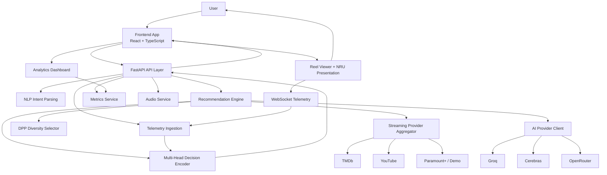

---

## 5) Frontend Architecture

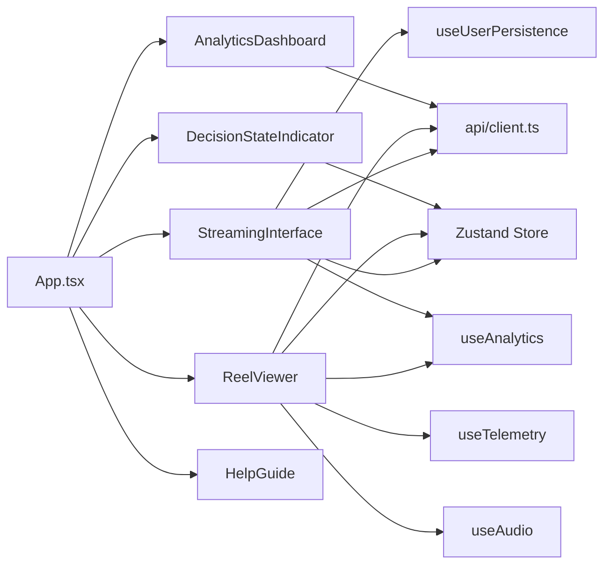

Frontend design intent:

- maintain low-latency user feedback,
- keep state synchronized across reel, analytics, and decision indicator,
- stream telemetry continuously during reel navigation.

---

## 6) Backend Architecture

```mermaid
flowchart LR
    MAIN[app/main.py] --> RREC[/api/recommendations]
    MAIN --> RTEL[/api/telemetry + /ws/telemetry]
    MAIN --> RDS[/api/decision-state]
    MAIN --> RMET[/api/metrics]
    MAIN --> RSTR[/api/streaming]
    MAIN --> RAUD[/api/audio]

    RREC --> SREC[recommendation_engine.py]
    RREC --> SNLP[nlp_service.py]

    RTEL --> SMHE[multi_head_encoder.py]
    RTEL --> SHAZ[survival_model.py]

    SREC --> SDPP[dpp_kernel.py]
    SREC --> SAPI[streaming_apis.py]
    SREC --> SAI[ai_client.py]

    RMET --> SMET[metrics_service.py]
    RMET --> SCAL[confidence_calibrator.py]

    RDS --> SDSS[decision_state_service.py]
    RSTR --> SAPI
```

Backend design intent:

- isolate route orchestration from ranking/control logic,
- provide deterministic fallback behavior when upstream providers fail,
- preserve telemetry-driven adaptive behavior under partial outages.

---

## 7) Core Technical Flow Diagrams

### 7.1 Decision-Control Loop

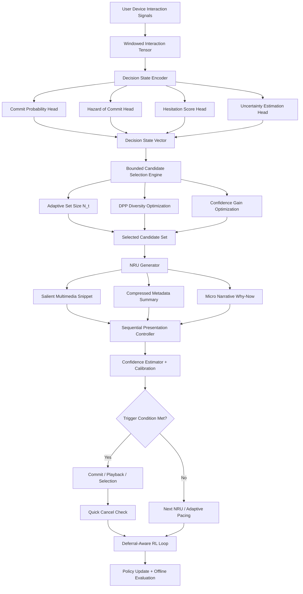

### 7.2 Encoder-to-Policy Pipeline

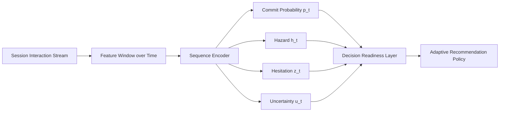

### 7.3 Presentation State Machine

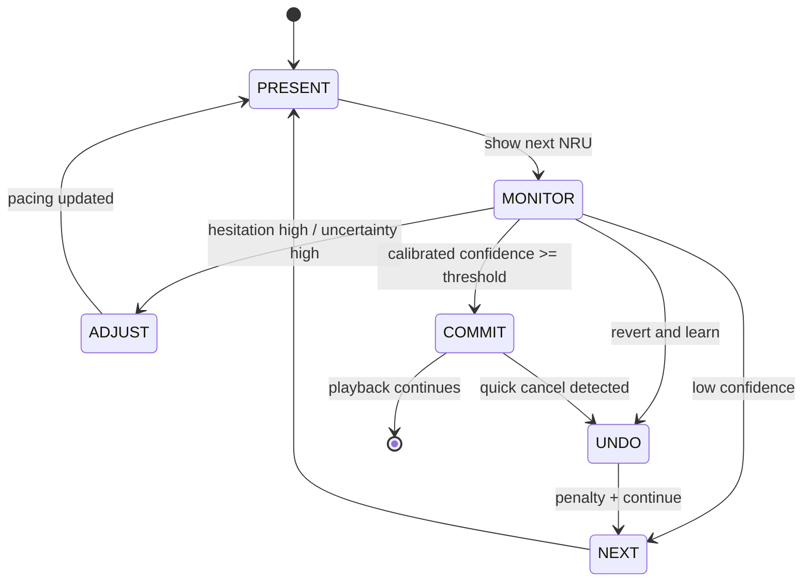

### 7.4 Adaptive Set Size + DPP Selection

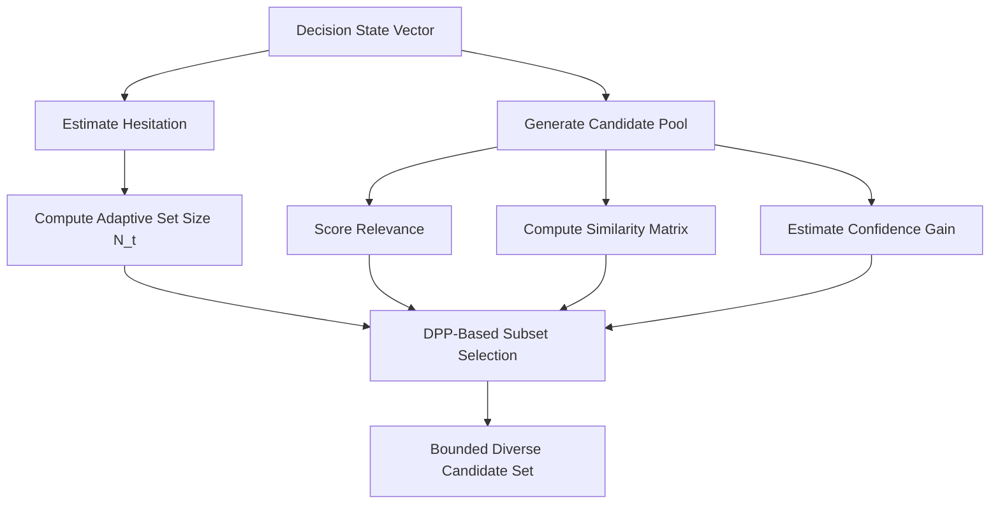

### 7.5 Confidence Trigger Guardrails

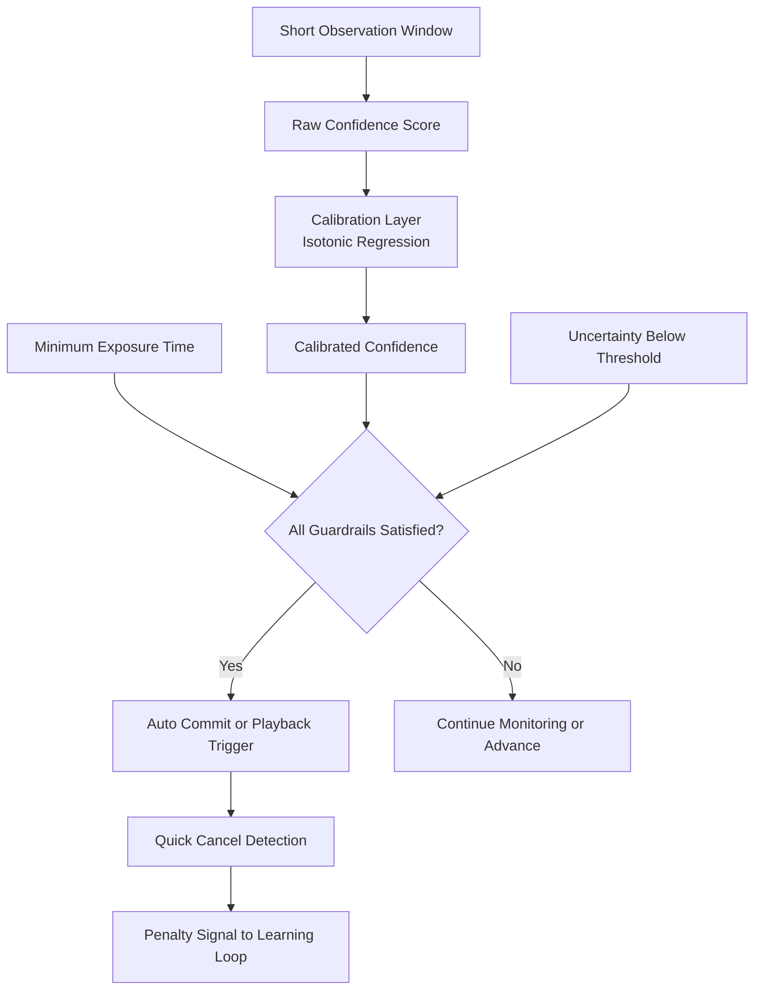

### 7.6 NRU Assembly Pipeline

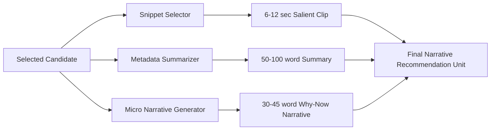

### 7.7 Outcome-to-Reward Composition

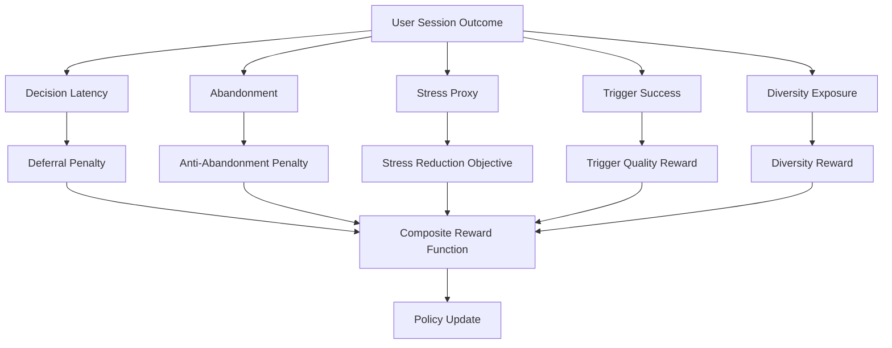

### 7.8 Phase-by-Phase Technical Rollout

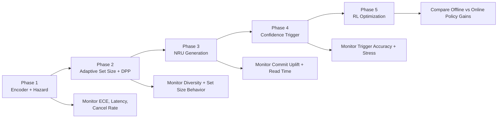

---

## 8) User Flows

### Flow A - Decisive User (Fast Commit)

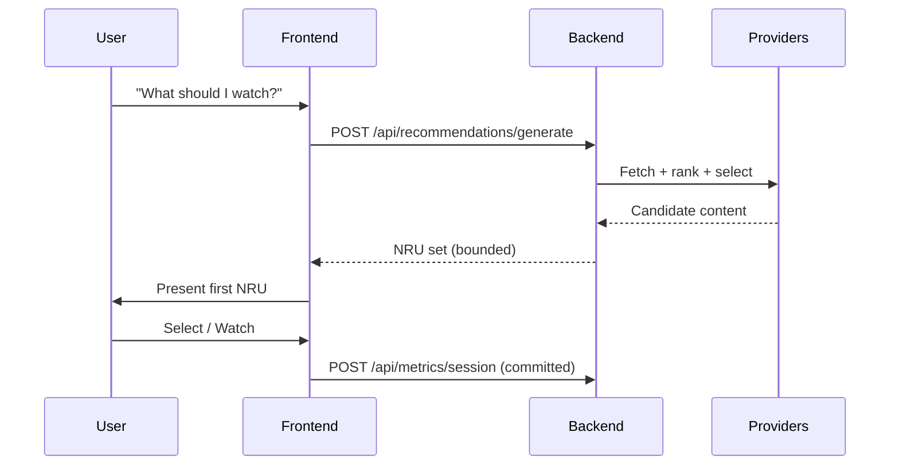

### Flow B - Hesitation Detected (Adaptive Narrowing)

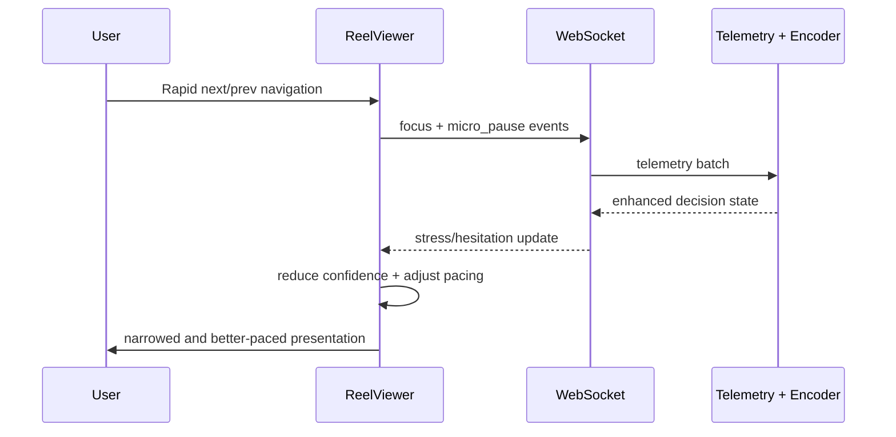

### Flow C - Abandonment Handling

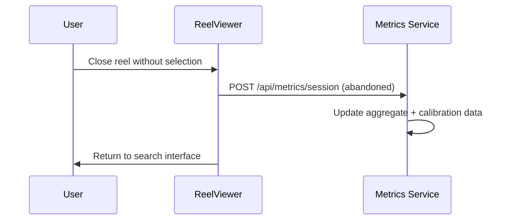

---

## 9) API Surface

| Endpoint | Method | Purpose |
|---|---|---|
| `/api/recommendations/generate` | POST | Generate bounded recommendation sequence |
| `/api/recommendations/content/{id}` | GET | Content details |
| `/api/recommendations/content/{id}/pitch` | POST | Micro-pitch generation |
| `/api/streaming/search` | GET | Provider-specific search (tmdb/youtube/paramount) |
| `/api/streaming/providers` | GET | Provider status |
| `/api/telemetry/batch` | POST | Telemetry ingestion (HTTP) |
| `/ws/telemetry/{user_id}` | WS | Real-time telemetry |
| `/api/decision-state/{user_id}` | GET | Decision state retrieval |
| `/api/metrics/session` | POST | Session outcome recording |
| `/api/metrics/aggregate` | GET | Aggregate metrics |
| `/api/metrics/realtime` | GET | Realtime metrics |
| `/api/audio/generate` | POST | TTS generation |
| `/health` | GET | Service health |
| `/docs` | GET | Swagger/OpenAPI docs |

---

## 10) Technical Components and Code Map

| Component | Responsibility | Primary Files |
|---|---|---|
| API boundary + config | FastAPI app bootstrap and settings | `backend/app/main.py`, `backend/app/config.py` |
| Intent parsing | Query intent/mood extraction | `backend/app/services/nlp_service.py` |
| Recommendation logic | Scoring, fallback, sequence generation | `backend/app/services/recommendation_engine.py` |
| Diversity and adaptive count | DPP subset selection + set-size behavior | `backend/app/services/dpp_kernel.py` |
| Decision-state estimation | Multi-head encoder, hazard estimates | `backend/app/services/multi_head_encoder.py`, `backend/app/services/survival_model.py` |
| Streaming providers | TMDb/YouTube/Paramount integration | `backend/app/services/streaming_apis.py` |
| AI provider failover | Groq/Cerebras/OpenRouter fallback | `backend/app/services/ai_client.py` |
| Telemetry routes | WS + HTTP telemetry ingestion | `backend/app/routes/telemetry.py` |
| Metrics + calibration | Commit/abandon outcomes and calibration | `backend/app/services/metrics_service.py`, `backend/app/services/confidence_calibrator.py` |
| Frontend orchestration | Search, reel, analytics, state indicator | `src/components/*`, `src/App.tsx` |
| Frontend state + hooks | Store, telemetry hook, analytics hook | `src/store/appStore.ts`, `src/hooks/useTelemetry.ts`, `src/hooks/useAnalytics.ts` |

---

## 11) Metrics and Evaluation

Core metrics used for monitoring and control:

- **CCR**: commit conversion behavior by NRU window.
- **DLR**: decision latency change relative to baseline.
- **DI / DE**: diversity behavior and exposure.
- **SRR**: stress reduction behavior.
- **CTA**: confidence trigger quality.
- **ECE**: calibration quality (confidence reliability).

These are surfaced in the in-app analytics dashboard and backend aggregate endpoints.

---

## 12) Security and Privacy

- API keys are configured via environment variables (`backend/.env`) and excluded from git.
- User identity in telemetry/metrics is pseudonymous by default.
- Session and telemetry data are used for control optimization and quality monitoring.
- Compliance routes are available for privacy/data-handling workflows.

---

## 13) Quick Start

### Option A: Docker

```bash
git clone https://github.com/parthassamal/Sequential-narrative-AI.git
cd Sequential-narrative-AI
cp backend/.env.example backend/.env
docker-compose up --build
```

### Option B: Local

```bash
# frontend
npm install

# backend
cd backend
python3 -m venv venv
source venv/bin/activate
pip install -r requirements.txt
```

Run services:

```bash
# backend (terminal 1)
cd backend
source venv/bin/activate
python -m uvicorn app.main:app --host 0.0.0.0 --port 8888 --reload

# frontend (terminal 2)
npm run dev
```

Access:

- Frontend: `http://localhost:3000` (or your configured dev port)
- Backend: `http://localhost:8888` (or your configured API port)
- Docs: `http://localhost:8888/docs`

---

## 14) Configuration

### Environment variables

| Variable | Required | Purpose |
|---|---|---|
| `OPENROUTER_API_KEY` | No | AI fallback provider |
| `GROQ_API_KEY` | No | Primary/fallback AI provider |
| `CEREBRAS_API_KEY` | No | Primary/fallback AI provider |
| `TMDB_API_KEY` | Recommended | Movie/TV metadata |
| `YOUTUBE_API_KEY` | Recommended | Trailer/video retrieval |
| `DEBUG` | No | Backend debug mode |
| `PORT` | No | Backend service port |

### Frontend API base

`src/api/client.ts` resolves API base dynamically using `VITE_API_URL` when provided.

---

## 15) Repository Structure

```text
Sequential-narrative-AI/
├── src/                      # Frontend (React + TypeScript)
│   ├── api/
│   ├── components/
│   ├── hooks/
│   ├── store/
│   └── types/
├── backend/                  # Backend (FastAPI + Python)
│   ├── app/
│   │   ├── routes/
│   │   ├── services/
│   │   ├── data/
│   │   ├── config.py
│   │   └── main.py
│   └── requirements.txt
├── docker-compose.yml
├── CLAUDE.md
└── README.md
```

---

## 16) License

MIT License. See `LICENSE`.
